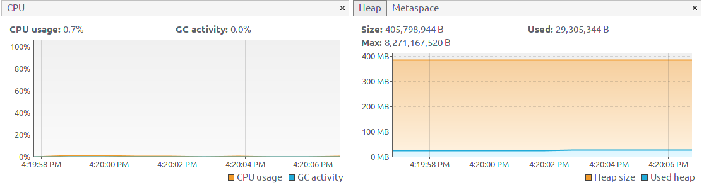
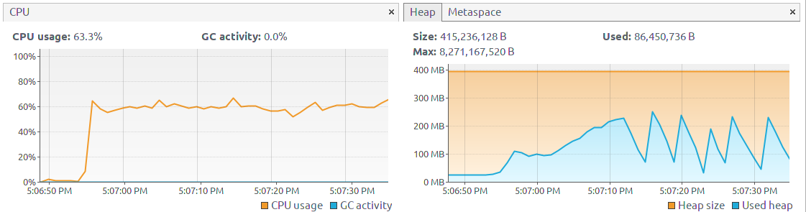
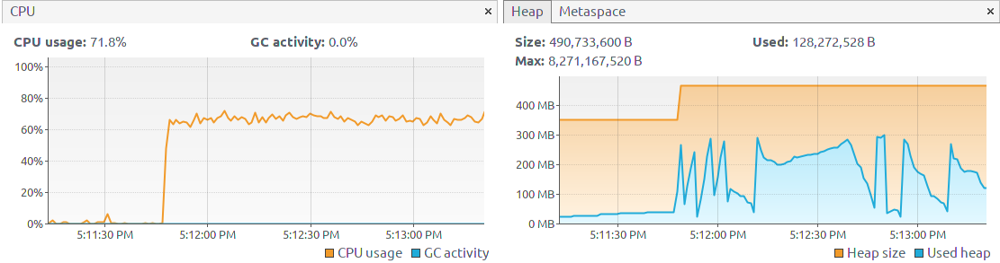
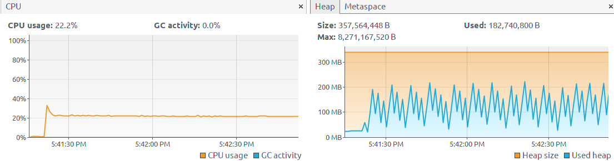
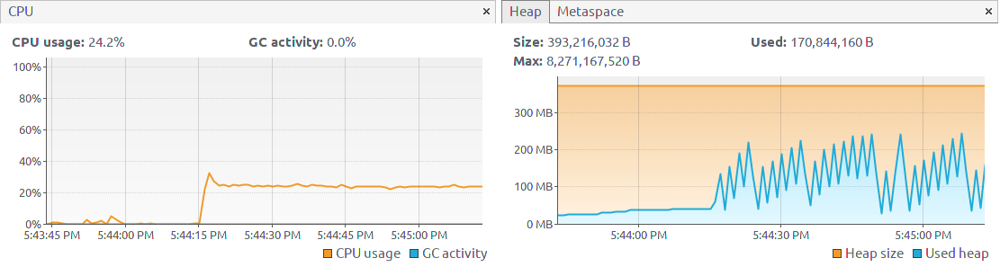

# exe5-Performance
- 环境：Ubuntu 18.04
- CPU：Intel(R) Core(TM) i7-7560U
- 测试工具：JMeter
- 监视工具：VisualVM
- 测试表达式：`1234*(4432+554)/45+34%3!`

## 无请求

无请求内存占用在30MB左右。

## 10线程，1s周期，未认证

- 吞吐量：2981.6次/s
- 平均响应时间：3ms

未认证情况下spring security会自动重定向到登陆界面，验证消耗资源，但java会自动回收内存故内存占用存在波动。

## 10线程，1s周期，已认证

- 吞吐量：2667.1次/s
- 平均响应时间：3ms

表达式计算消耗资源，电脑明显卡顿，可以看出java虚拟机自动扩容了Max heap size，CPU和内存占用相比未认证较多。

## 1线程，10s周期，未认证

- 吞吐量：1257.1次/s
- 平均响应时间：0.5ms

由于CPU未满载，可以看出内存占用存在明显周期性。

## 1线程，10s周期，已认证

- 吞吐量：1105.6次/s
- 平均响应时间：0.5ms

相比未认证，CPU和内存占用依然略多。

## 总结
1. 高并发下对CPU占用远比内存占用多，且测试平台为笔记本低压处理器，在测试条件下成为瓶颈。
2. Java虚拟机对堆大小管理是动态的且存在自动回收机制，因此可以看到在本次测试中基本都保持在300MB的范围内。
3. 考虑到10线程时加上测试软件的CPU占用已经达到了100%，且再增大线程数对吞吐量无太大影响，因此可以将其作为极限负载，实际环境下由于带宽延迟等原因可能有所降低。